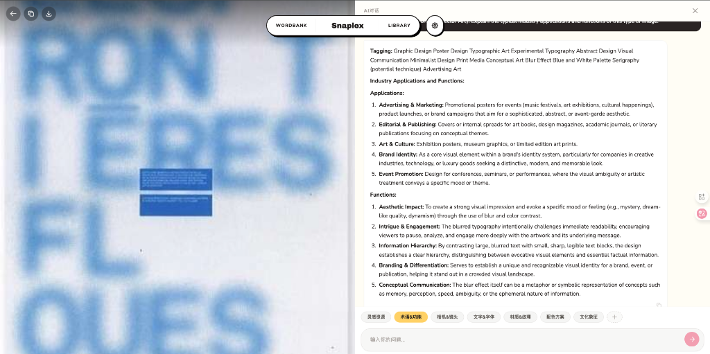
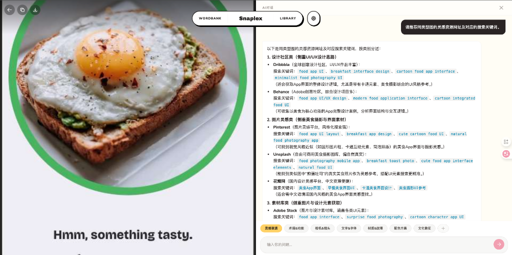
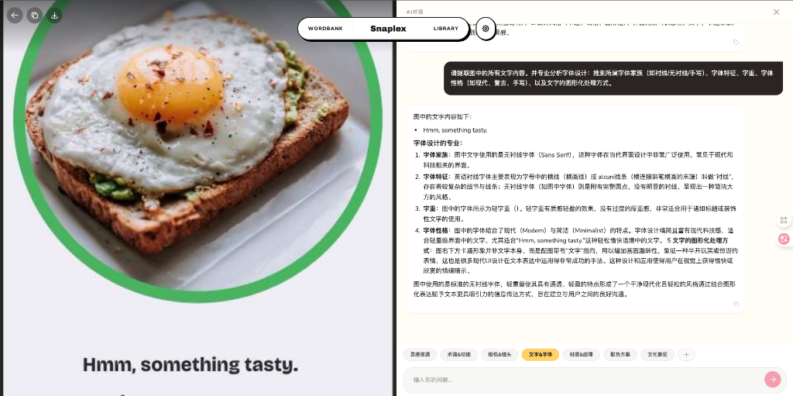
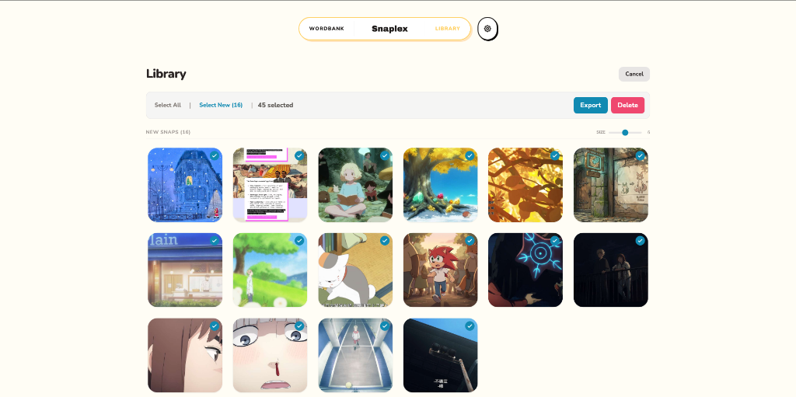
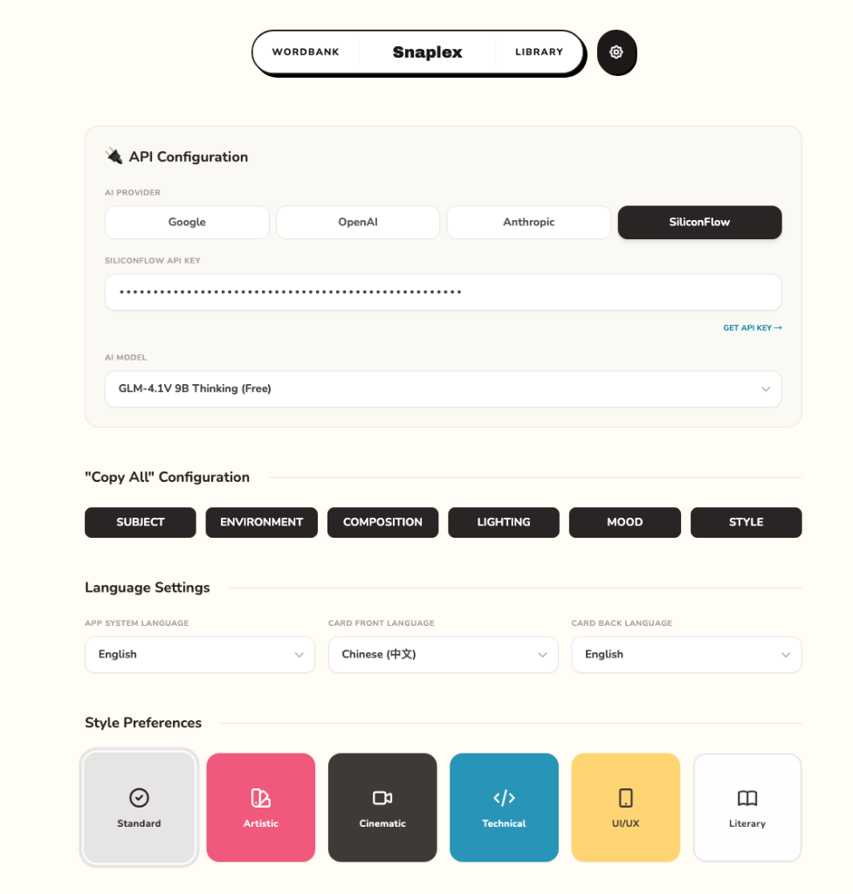

<div align="center">


# Snaplex - AI Image Analysis & Prompt Reverse Studio

Snaplex is an intelligent visual analysis and prompt engineering studio designed for AI creators. 
Snaplex allows you to extract structured prompts, mine professional visual terms, and manage your creative inspirations—all fully local and privacy-first.
It transforms how you explore images by combining **Deep Visual Insights**, a **Personalized Inspiration Library**, and **Batch Operations** into a seamless workflow. With support for **7-Language Prompt Generation** and leading AI models (Gemini, OpenAI, Claude, SiliconFlow).

</div>

## Features

-   **Get Structured Prompt**: Get structured breakdowns of your images:
    
    -   Subject
    -   Environment
    -   Composition
    -   Lighting
    -   Mood
    -   Style
-   **Deep Visual Insight**: Go beyond basic analysis with an interactive **Chat Mode**. Use preset or custom tags to query specific visual details and gain deeper insights.
    
    
    
-   **Personalized Inspiration Library**: All analyzed images are saved locally. Rediscover your past inspirations using **fuzzy search** to find specific terms or concepts and spark new ideas.
    
-   **Visual Term Printer**: "Mining" your history to build a glossary of visual terms with definitions and application context.
    
    
-   **Batch Operations**: Efficiently extract and **export** structured prompt data from multiple images at once.
    
-   **7-Language Support**: Simultaneously generate prompts in different languages for the same image, optimized for various AI models. Supports **English, Chinese, Spanish, Japanese, French, German, and Korean**.
-   **Multi-Model Support**: Switch seamlessly between **Google Gemini**, **OpenAI (GPT-4o)**, **Claude**, and **SiliconFlow**.
    
-   **Local History**: Your analysis history is saved locally in your browser (IndexedDB), ensuring privacy and quick access.

## Getting Started

Snaplex is a client-side application running on Vite.

### Prerequisites

-   Node.js (v18 or higher recommended)
-   npm or yarn

### Installation

1.  Clone the repository:
    ```bash
    git clone https://github.com/ginger4soda-netizen/snaplex.git
    cd snaplex
    ```
2.  Install dependencies:
    ```bash
    npm install
    ```

### Configuration

Snaplex uses **Client-Side Storage** for API keys. You do **not** need to set up a `.env` file for API keys.

1.  Run the application:
    ```bash
    npm run dev
    ```
2.  Open your browser to `http://localhost:3000`.
3.  Click on the **Settings** (Gear Icon) in the top right.
4.  Select your preferred **AI Provider** (e.g., Gemini) and enter your API Key.
5.  Save Settings.

> **Note**: Your API keys are stored securely in your browser's local storage and are never sent to any server other than the AI provider's API directly.

## Usage

1.  **Upload**: Drag & drop an image onto the home screen.
2.  **Analyze**: Waiting for the AI to deconstruct the image.
3.  **Explore**:
    -   View the **Analysis** to see the structured breakdown.
    -   Use the **Printer** view to see a stylized "receipt" of your image's DNA.
    -   Chat with the AI about the image to refine the prompt.

## Technology Stack

-   **Frontend**: React, TypeScript, Vite
-   **Styling**: TailwindCSS
-   **State/Storage**: IndexedDB (idb-keyval)
-   **Markdown**: React Markdown

## License & Business Model

Snaplex 采用 **双重授权模式 (Dual Licensing)**，旨在平衡开源社区的繁荣与项目的可持续发展。

### 🔓 对于开源社区/个人用户

**核心代码** 基于 **GNU Affero通用公共许可证 v3 (AGPL-3.0)** 开源：

```
Copyright (c) 2025-present Snaplex Contributors
Licensed under AGPL-3.0
```

**您可以自由地：**
- ✅ 使用、修改、分发本软件
- ✅ 用于个人学习、研究或商业项目

**但您必须遵守：**
- ⚠️ **强制开源义务**：如果您修改代码后提供网络服务（如 SaaS）或分发修改版本，**必须以 AGPL-3.0 协议公开您的全部源代码**
- ⚠️ **传染性条款**：任何与 Snaplex 核心代码链接或集成的软件，也必须遵循 AGPL-3.0

> [!IMPORTANT]
> **AGPL-3.0 != 禁止商业使用**  
> 该协议禁止的是**闭源商业化**（即使用我们的代码构建闭源产品），而非商业使用本身。
> 如果您需要将 Snaplex 集成到闭源产品中，请查看下方的商业授权选项。

### 💼 对于企业/商业客户

如果您的业务场景包括：
- 🏢 将 Snaplex 集成到专有/闭源软件产品中
- 🔒 不希望公开您的源代码或商业逻辑
- 🚀 需要技术支持、定制开发或 SLA 保障

您需要购买 **商业授权 (Commercial License)**，它将授予您：
- ✅ **豁免 AGPL-3.0 的开源义务**
- ✅ 保留代码私有的权利
- ✅ 企业级技术支持与优先更新
- ✅ 法律合规保障

**商业授权咨询：**  
📧 Email: ginger4soda@gmail.com

---

### 🤝 贡献者须知

**重要：代码版权协议 (CLA)**

为了维持双重授权模式的法律有效性，所有外部贡献者在提交代码前必须签署 **贡献者许可协议 (Contributor License Agreement, CLA)**。

> [!CAUTION]
> **为什么需要 CLA？**  
> 双重授权要求项目拥有代码的完整版权。CLA 确保您授权项目维护者：
> 1. 将您的贡献以 AGPL-3.0 开源
> 2. 将您的贡献纳入商业授权版本
>
> **不签署 CLA 的后果：** 您的 Pull Request 将无法被合并。

CLA 文档与签署流程请参阅：[CLA.md](./CLA.md)

---

### 📖 完整条款

- AGPL-3.0 许可证全文：[LICENSE](./LICENSE)
- 商业授权示例协议：联系商务团队获取
- 贡献者许可协议：[CLA.md](./CLA.md)
