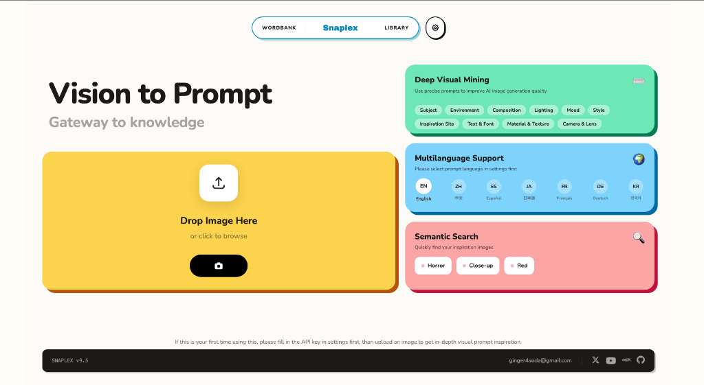
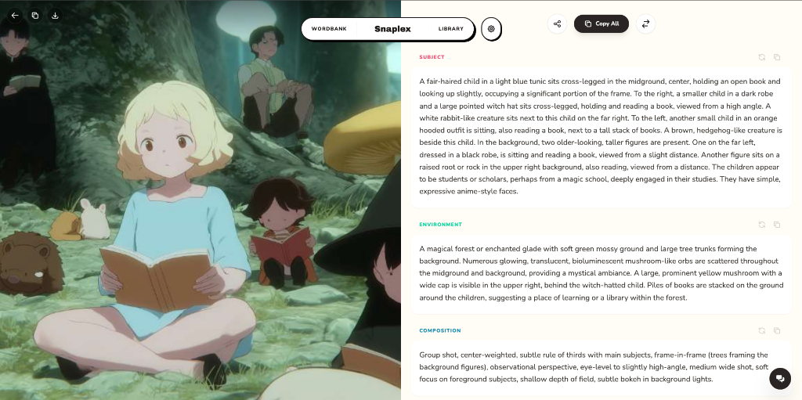
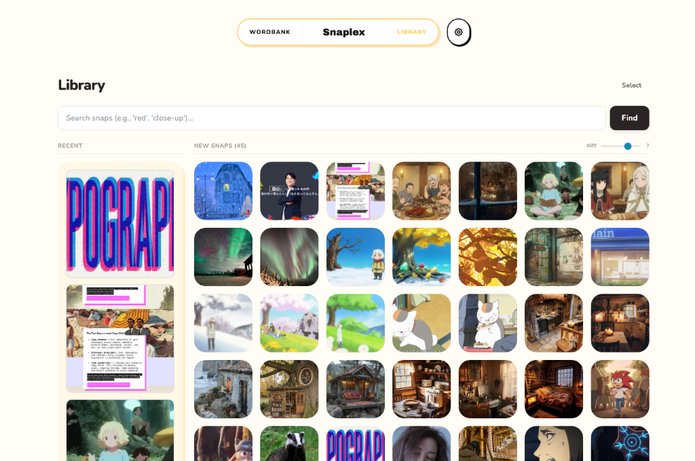
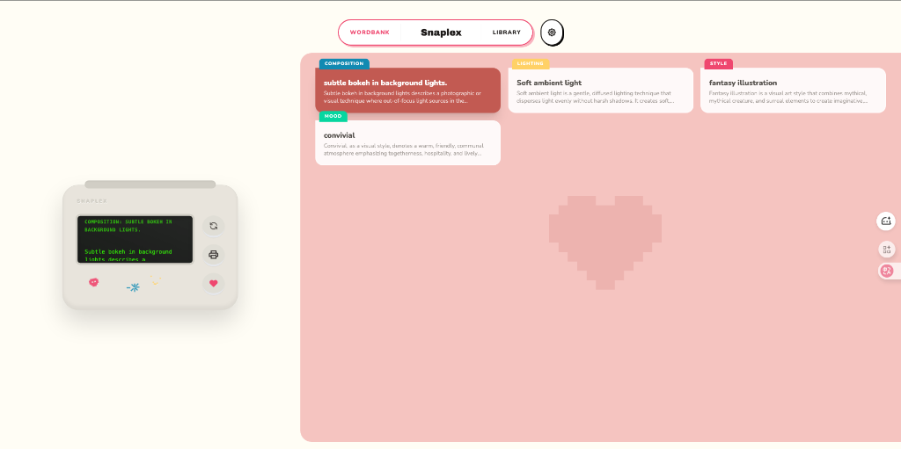
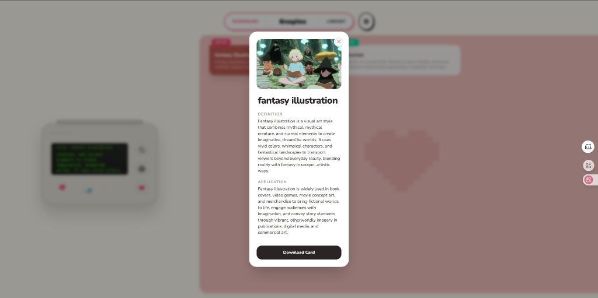

<div align="center">


# Snaplex - AI Image Analysis & Prompt Reverse Studio

Snaplex is an intelligent visual analysis and prompt engineering studio designed for AI creators. 
Snaplex allows you to extract structured prompts, mine professional visual terms, and manage your creative inspirations—all fully local and privacy-first.
It transforms how you explore images by combining **Deep Visual Insights**, a **Personalized Inspiration Library**, and **Batch Operations** into a seamless workflow. With support for **7-Language Prompt Generation** and leading AI models (Gemini, OpenAI, Claude, SiliconFlow).

</div>

## Features

-   **Get Structured Prompt**: Get structured breakdowns of your images:
    
    -   Subject
    -   Environment
    -   Composition
    -   Lighting
    -   Mood
    -   Style
-   **Deep Visual Insight**: Go beyond basic analysis with an interactive **Chat Mode**. Use preset or custom tags to query specific visual details and gain deeper insights.
-   **Personalized Inspiration Library**: All analyzed images are saved locally. Rediscover your past inspirations using **fuzzy search** to find specific terms or concepts and spark new ideas.
    
-   **Visual Term Printer**: "Mining" your history to build a glossary of visual terms with definitions and application context.
    
    
-   **Batch Operations**: Efficiently extract and **export** structured prompt data from multiple images at once.
-   **7-Language Support**: Simultaneously generate prompts in different languages for the same image, optimized for various AI models. Supports **English, Chinese, Spanish, Japanese, French, German, and Korean**.
-   **Multi-Model Support**: Switch seamlessly between **Google Gemini**, **OpenAI (GPT-4o)**, **Claude**, and **SiliconFlow**.
-   **Local History**: Your analysis history is saved locally in your browser (IndexedDB), ensuring privacy and quick access.

## Getting Started

Snaplex is a client-side application running on Vite.

### Prerequisites

-   Node.js (v18 or higher recommended)
-   npm or yarn

### Installation

1.  Clone the repository:
    ```bash
    git clone https://github.com/ginger4soda-netizen/snaplex.git
    cd snaplex
    ```
2.  Install dependencies:
    ```bash
    npm install
    ```

### Configuration

Snaplex uses **Client-Side Storage** for API keys. You do **not** need to set up a `.env` file for API keys.

1.  Run the application:
    ```bash
    npm run dev
    ```
2.  Open your browser to `http://localhost:3000`.
3.  Click on the **Settings** (Gear Icon) in the top right.
4.  Select your preferred **AI Provider** (e.g., Gemini) and enter your API Key.
5.  Save Settings.

> **Note**: Your API keys are stored securely in your browser's local storage and are never sent to any server other than the AI provider's API directly.

## Usage

1.  **Upload**: Drag & drop an image onto the home screen.
2.  **Analyze**: Waiting for the AI to deconstruct the image.
3.  **Explore**:
    -   View the **Analysis** to see the structured breakdown.
    -   Use the **Printer** view to see a stylized "receipt" of your image's DNA.
    -   Chat with the AI about the image to refine the prompt.

## Technology Stack

-   **Frontend**: React, TypeScript, Vite
-   **Styling**: TailwindCSS
-   **State/Storage**: IndexedDB (idb-keyval)
-   **Markdown**: React Markdown

## License

This project is licensed under the MIT License - see the [LICENSE](LICENSE) file for details.
