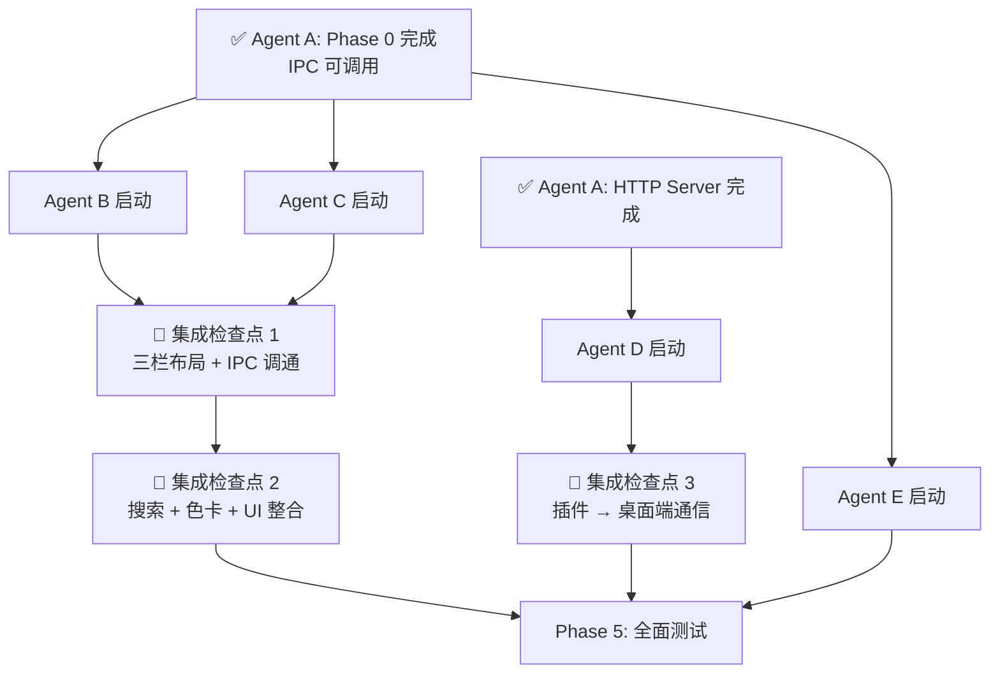

# Snaplex Desktop App — Master Specification v4

> **此文档是所有 Agent 的唯一上下文来源。** 每个 Agent 实例从空白上下文启动，仅依赖此文档理解项目全貌并执行分配的任务。

---

## 1. 项目概述

**Snaplex** 是一个 AI 驱动的图片提示词灵感库。当前为 Vite + React + TypeScript 的纯 Web SPA，使用 `idb-keyval` (IndexedDB) 存储数据，调用 Gemini/OpenAI/Claude/SiliconFlow API 分析图片生成 6 维度结构化提示词。

**目标**：转型为类 Eagle 的本地桌面应用（Tauri v2），三栏布局，本地文件系统 + SQLite 存储，混合语义搜索，色卡提取，浏览器插件，保留网页端作为 Landing Page。

## 2. 现有代码库结构

```
/Users/ccginger/Downloads/Antigravity/Snaplex-1231/snaplex/    ← 项目根目录
├── App.tsx                  # 主应用路由（home/analysis/chat/history/settings/printer）
├── index.tsx / index.html   # 入口
├── types.ts                 # 核心类型：HistoryItem, AnalysisResult, PromptSegment, DimensionKey
├── translations.ts          # 多语言翻译（EN/CN/ES/JA/FR/DE/KR）
├── components/
│   ├── Home.tsx             # 首页（上传+功能展示 BentoBox 布局）
│   ├── AnalysisView.tsx     # 分析结果页（左右分栏：图片+6维度卡片+Memo+Chat）
│   ├── History.tsx          # 图库（搜索+网格+选择+导出/导入）
│   ├── ChatBot.tsx          # AI 对话
│   ├── Settings.tsx         # 设置页（API key/Provider/Model/语言）
│   ├── StylePrinter.tsx     # 打印机工具（术语学习）
│   ├── Header.tsx           # 导航栏
│   └── (其他辅助组件)
├── services/
│   ├── geminiService.ts     # 统一 AI 服务层（analyzeImage, searchHistory, chatStream, regenerateDimension）
│   └── providers/
│       ├── types.ts         # AIProvider 接口 + ProviderType + ModelDefinition + STORAGE_KEYS
│       ├── index.ts         # Provider 工厂（getProvider）
│       ├── gemini.ts / openai.ts / claude.ts / siliconflow.ts
│       └── masterPrompt.ts  # 分析提示词模板
├── hooks/useAppState.ts     # useSettings + useHistory hooks
├── utils/                   # clipboard, translate, jsonParser, async, importHistory, etc.
├── observability/           # Sentry + Vercel Analytics
├── vite.config.ts           # Vite 配置（port 3000）
├── tailwind.config.js       # TailwindCSS 配置
└── package.json             # React 19, Vite 6, Vitest, TailwindCSS 3
```

### 核心数据类型（来自 [types.ts](file:///Users/ccginger/Downloads/Antigravity/Snaplex-1231/snaplex/types.ts)）

```typescript
interface AnalysisResult {
  description: string;
  structuredPrompts: {
    subject: PromptSegment;     // { original: string, translated: string }
    environment: PromptSegment;
    composition: PromptSegment;
    lighting: PromptSegment;
    style: PromptSegment;
    mood: PromptSegment;
  };
}

interface HistoryItem {
  id: string; timestamp: number; imageUrl: string;  // base64 data URL
  analysis: AnalysisResult;
  isFavorite?: boolean; chatHistory?: ChatMessage[];
  read?: boolean; lastViewedAt?: number; lastExported?: number;
  dimensionHistories?: DimensionHistories;
  memo?: string;
}

type DimensionKey = 'subject' | 'environment' | 'composition' | 'lighting' | 'mood' | 'style';
type AppMode = 'home' | 'analysis' | 'chat' | 'history' | 'settings' | 'printer';
```

### 现有 AI Provider 接口（来自 [services/providers/types.ts](file:///Users/ccginger/Downloads/Antigravity/Snaplex-1231/snaplex/services/providers/types.ts)）

```typescript
interface AIProvider {
  readonly name: string;
  analyzeImage(base64Image: string, settings: UserSettings): Promise<AnalysisResult>;
  explainTerm(term: string, language: string): Promise<TermExplanation>;
  chatStream(history, message, image, onUpdate, settings?): Promise<void>;
  translateText(text: string, language: string): Promise<string>;
  expandSearchQuery(query: string): Promise<string[][]>;
  regenerateDimension(base64Image, dimension, settings): Promise<PromptSegment>;
}
type ProviderType = 'gemini' | 'openai' | 'claude' | 'siliconflow';
```

---

## 3. 已确认决策

| 项 | 决策 |
|----|------|
| 桌面框架 | **Tauri v2** + `tauri-plugin-updater` + GitHub Releases |
| 搜索 | **FTS5 全文 + API Text Embedding + 本地 CLIP 视觉向量** |
| Text Embedding | **纯 API**（用户已有 key，$0.04/万张，导入时缓存，搜索不消耗） |
| 视觉搜索 | **CLIP ViT-B-32 INT8**（153MB，随 App 打包，本地推理 ~10ms/张） |
| 文件夹 | Obsidian 式双向文件系统同步（Rust `notify` crate） |
| 一图多文件夹 | 主文件夹存物理文件 + 其他文件夹 symlink + `image_folders` 关联表 |
| 色卡 | K-means 聚类，默认 8 色，用户可配 |
| 翻译 | 提示词卡片背面用 **Google Translate 免费 API** |
| 多图库 | ✅ `.snpx` 文件夹（可拖到其他电脑打开） |
| Provider | Gemini / OpenAI / Claude / SiliconFlow |
| 右键菜单 | 复制 / 下载 / 打开文件夹 / 分析 / 移动 |
| 按需分析 | 单图：空白 N/A 面板按维度刷新；多图：功能菜单批量操作 |
| 主题 | Light（沿用网页端）+ Dark |
| Schema | 预留 `asset_type`，Phase 0-3 专注图片 |
| Changelog | Conventional Commits + release-please |
| 插件 | Chrome 优先 |
| Eagle 导入 | Phase 3+ |

---

## 4. 目标目录结构

```
snaplex/
├── src-tauri/                          # [Agent A] Rust 后端
│   ├── Cargo.toml
│   ├── tauri.conf.json
│   ├── src/
│   │   ├── main.rs / lib.rs
│   │   ├── db/                         # SQLite 操作
│   │   │   ├── mod.rs
│   │   │   ├── schema.rs              # CREATE TABLE 语句
│   │   │   ├── images.rs              # CRUD
│   │   │   ├── folders.rs
│   │   │   ├── analysis.rs
│   │   │   ├── search.rs             # FTS5 + 向量搜索
│   │   │   └── embeddings.rs
│   │   ├── fs/                         # 文件系统操作
│   │   │   ├── mod.rs
│   │   │   ├── watcher.rs            # notify crate 双向同步
│   │   │   ├── thumbnailer.rs        # 缩略图生成
│   │   │   └── library.rs            # .snpx 库管理
│   │   ├── clip/                       # CLIP 推理
│   │   │   ├── mod.rs
│   │   │   └── inference.rs
│   │   ├── color/                      # 色卡提取
│   │   │   └── palette.rs
│   │   ├── commands/                   # Tauri IPC Commands
│   │   │   ├── mod.rs
│   │   │   ├── image_commands.rs
│   │   │   ├── folder_commands.rs
│   │   │   ├── search_commands.rs
│   │   │   ├── analysis_commands.rs
│   │   │   └── library_commands.rs
│   │   └── server/                     # HTTP Server（浏览器插件接收）
│   │       └── mod.rs
│   └── models/                         # CLIP 模型文件
│       └── clip-vit-b-32-int8.onnx
│
├── src/                                # [Agent B/C] React 前端
│   ├── App.tsx                         # 三栏布局主框架
│   ├── index.tsx / index.css
│   ├── types.ts                        # 扩展后的类型
│   ├── components/
│   │   ├── layout/                     # [Agent B] 三栏布局
│   │   │   ├── ThreeColumnLayout.tsx
│   │   │   ├── Sidebar.tsx            # 左栏：文件夹树 + Tools
│   │   │   ├── ImageGrid.tsx          # 中栏：网格 + 搜索栏
│   │   │   └── DetailPanel.tsx        # 右栏：详情页
│   │   ├── folders/                    # [Agent B] 文件夹相关
│   │   │   ├── FolderTree.tsx
│   │   │   └── FolderContextMenu.tsx
│   │   ├── images/                     # [Agent B] 图片相关
│   │   │   ├── ImageCard.tsx
│   │   │   ├── ImageContextMenu.tsx
│   │   │   └── BatchActionMenu.tsx
│   │   ├── detail/                     # [Agent B] 右栏详情
│   │   │   ├── ImagePreview.tsx
│   │   │   ├── ColorPalette.tsx       # [Agent C] 色卡 UI
│   │   │   ├── SourceInfo.tsx
│   │   │   ├── DimensionCards.tsx     # 可折叠 6 维度
│   │   │   ├── MemoCard.tsx           # 复用现有
│   │   │   └── ChatPanel.tsx          # 复用现有 ChatBot
│   │   ├── search/                     # [Agent C] 搜索 UI
│   │   │   ├── SearchBar.tsx
│   │   │   └── SearchResults.tsx
│   │   ├── tools/                      # [Agent B] 工具
│   │   │   └── StylePrinter.tsx       # 复用现有
│   │   ├── settings/
│   │   │   ├── Settings.tsx
│   │   │   └── ThemeToggle.tsx
│   │   └── common/                     # 共享组件
│   │       ├── ContextMenu.tsx
│   │       └── VirtualGrid.tsx
│   ├── hooks/
│   │   ├── useAppState.ts
│   │   ├── useTauriIPC.ts            # Tauri invoke 封装
│   │   ├── useTheme.ts
│   │   └── useFileWatcher.ts
│   ├── services/                       # 复用现有 + 扩展
│   │   ├── geminiService.ts
│   │   ├── providers/                 # 保持不变
│   │   ├── tauriBridge.ts             # IPC 调用层
│   │   └── googleTranslate.ts        # Google Translate API
│   └── utils/                          # 复用现有
│
├── extension/                          # [Agent D] Chrome 浏览器插件
│   ├── manifest.json
│   ├── content.js                     # Content Script（悬浮 Logo）
│   ├── background.js                  # Service Worker
│   ├── popup.html / popup.js          # 插件弹窗
│   └── icons/
│
├── landing/                            # [Agent E] Landing Page
│   ├── index.html
│   ├── styles.css
│   ├── app.js
│   └── assets/
│
├── tests/                              # [Agent F] 测试
│   ├── unit/
│   ├── e2e/
│   └── benchmarks/
│
├── .github/workflows/                  # CI/CD
│   ├── build.yml                      # 跨平台构建
│   ├── release.yml                    # release-please + 自动更新
│   └── test.yml
│
└── package.json / vite.config.ts / tailwind.config.js
```

---

## 5. Tauri IPC 命令契约（前后端共享接口）

> **这是 Agent A 和 Agent B/C 之间的关键契约。两方必须严格遵守。**

### 5.1 图库管理

```typescript
// 打开/创建图库
invoke('open_library', { path: string }): Promise<LibraryInfo>
invoke('create_library', { path: string, name: string }): Promise<LibraryInfo>
invoke('get_current_library'): Promise<LibraryInfo | null>

interface LibraryInfo {
  path: string; name: string; imageCount: number; createdAt: string;
}
```

### 5.2 文件夹操作

```typescript
invoke('get_folder_tree'): Promise<FolderNode[]>
invoke('create_folder', { name: string, parentId: string | null }): Promise<FolderNode>
invoke('rename_folder', { id: string, name: string }): Promise<void>
invoke('delete_folder', { id: string }): Promise<void>
invoke('move_folder', { id: string, newParentId: string | null }): Promise<void>

interface FolderNode {
  id: string; name: string; parentId: string | null;
  children: FolderNode[]; imageCount: number;
}
```

### 5.3 图片操作

```typescript
invoke('get_images', { folderId?: string, offset: number, limit: number }): Promise<ImageItem[]>
invoke('import_images', { filePaths: string[], folderId?: string }): Promise<ImportResult>
invoke('delete_images', { ids: string[] }): Promise<void>
invoke('move_images', { ids: string[], targetFolderId: string }): Promise<void>
invoke('link_image_to_folder', { imageId: string, folderId: string }): Promise<void>
invoke('get_image_detail', { id: string }): Promise<ImageDetail>
invoke('update_image_memo', { id: string, memo: string }): Promise<void>
invoke('toggle_favorite', { id: string }): Promise<boolean>
invoke('open_image_in_finder', { id: string }): Promise<void>
invoke('export_images', { ids: string[], format: string }): Promise<string>  // 返回导出文件路径

interface ImageItem {
  id: string; filename: string; thumbUrl: string;  // file:// URL
  width: number; height: number; isFavorite: boolean;
  hasAnalysis: boolean; createdAt: string;
}

interface ImageDetail extends ImageItem {
  fullUrl: string;  // file:// URL to original
  memo: string; sourceUrl: string | null;
  analysis: AnalysisResult | null;
  colorPalette: ColorInfo[] | null;
  folderIds: string[];
}

interface ColorInfo {
  hex: string; rgb: [number, number, number]; hsl: [number, number, number];
  percentage: number; name: string;  // 近似颜色名
}

interface ImportResult {
  imported: number; failed: number; errors: string[];
}
```

### 5.4 分析

```typescript
invoke('get_analysis', { imageId: string }): Promise<AnalysisResult | null>
invoke('save_analysis', { imageId: string, analysis: AnalysisResult, provider: string, model: string }): Promise<void>
invoke('get_dimension_history', { imageId: string, dimension: DimensionKey }): Promise<DimensionVersion[]>
invoke('save_dimension_version', { imageId: string, dimension: DimensionKey, original: string, translated: string }): Promise<void>

interface DimensionVersion {
  version: number; original: string; translated: string; isCurrent: boolean; createdAt: string;
}
```

### 5.5 搜索

```typescript
invoke('search_images', { query: string, folderId?: string }): Promise<SearchResult[]>
invoke('save_text_embedding', { imageId: string, vector: number[], model: string }): Promise<void>

// CLIP 视觉搜索（后端执行，前端只传 query 文本）
invoke('visual_search', { query: string, limit: number }): Promise<SearchResult[]>

interface SearchResult {
  imageId: string; score: number; matchType: 'fts' | 'embedding' | 'clip';
}
```

### 5.6 色卡

```typescript
invoke('extract_color_palette', { imageId: string, colorCount?: number }): Promise<ColorInfo[]>
invoke('get_color_palette', { imageId: string }): Promise<ColorInfo[] | null>
```

### 5.7 系统

```typescript
invoke('check_for_update'): Promise<UpdateInfo | null>
invoke('install_update'): Promise<void>

interface UpdateInfo {
  version: string; releaseNotes: string; publishedAt: string;
}

// 文件系统事件（后端 → 前端，Tauri Event）
listen('fs-change', (event: { type: 'add' | 'remove' | 'modify', path: string, imageId?: string }) => void)
```

---

## 6. 数据库 Schema

```sql
CREATE TABLE folders (
  id TEXT PRIMARY KEY, name TEXT NOT NULL,
  parent_id TEXT REFERENCES folders(id) ON DELETE CASCADE,
  sort_order INTEGER DEFAULT 0,
  created_at DATETIME DEFAULT CURRENT_TIMESTAMP
);

CREATE TABLE images (
  id TEXT PRIMARY KEY, filename TEXT NOT NULL,
  file_path TEXT NOT NULL, thumb_path TEXT,
  width INTEGER, height INTEGER, file_size INTEGER, format TEXT,
  asset_type TEXT DEFAULT 'image',
  source_url TEXT,
  is_favorite BOOLEAN DEFAULT 0, memo TEXT,
  has_analysis BOOLEAN DEFAULT 0,
  created_at DATETIME DEFAULT CURRENT_TIMESTAMP,
  updated_at DATETIME DEFAULT CURRENT_TIMESTAMP
);

CREATE TABLE image_folders (
  image_id TEXT NOT NULL REFERENCES images(id) ON DELETE CASCADE,
  folder_id TEXT NOT NULL REFERENCES folders(id) ON DELETE CASCADE,
  PRIMARY KEY (image_id, folder_id)
);

CREATE TABLE analysis (
  id TEXT PRIMARY KEY, image_id TEXT UNIQUE NOT NULL REFERENCES images(id) ON DELETE CASCADE,
  description TEXT,
  subject_en TEXT, subject_cn TEXT,
  environment_en TEXT, environment_cn TEXT,
  composition_en TEXT, composition_cn TEXT,
  lighting_en TEXT, lighting_cn TEXT,
  mood_en TEXT, mood_cn TEXT,
  style_en TEXT, style_cn TEXT,
  provider TEXT, model TEXT,
  created_at DATETIME DEFAULT CURRENT_TIMESTAMP
);

CREATE VIRTUAL TABLE search_index USING fts5(
  image_id, content, memo, tokenize='unicode61'
);

CREATE TABLE color_palettes (
  id TEXT PRIMARY KEY, image_id TEXT UNIQUE NOT NULL REFERENCES images(id) ON DELETE CASCADE,
  colors TEXT NOT NULL, color_count INTEGER DEFAULT 8,
  created_at DATETIME DEFAULT CURRENT_TIMESTAMP
);

CREATE TABLE embeddings (
  image_id TEXT PRIMARY KEY REFERENCES images(id) ON DELETE CASCADE,
  vector BLOB NOT NULL, model TEXT, dimension INTEGER,
  created_at DATETIME DEFAULT CURRENT_TIMESTAMP
);

CREATE TABLE visual_embeddings (
  image_id TEXT PRIMARY KEY REFERENCES images(id) ON DELETE CASCADE,
  vector BLOB NOT NULL, model TEXT, dimension INTEGER,
  created_at DATETIME DEFAULT CURRENT_TIMESTAMP
);

CREATE TABLE dimension_history (
  id TEXT PRIMARY KEY, image_id TEXT NOT NULL REFERENCES images(id) ON DELETE CASCADE,
  dimension TEXT NOT NULL, version INTEGER NOT NULL,
  original TEXT, translated TEXT, is_current BOOLEAN DEFAULT 1,
  created_at DATETIME DEFAULT CURRENT_TIMESTAMP
);

CREATE TABLE chat_messages (
  id TEXT PRIMARY KEY, image_id TEXT NOT NULL REFERENCES images(id) ON DELETE CASCADE,
  role TEXT NOT NULL, text TEXT NOT NULL,
  created_at DATETIME DEFAULT CURRENT_TIMESTAMP
);
```

---

## 7. 全部 Phase 详细说明

### Phase 0：Tauri 基础设施 ⏱️ ~1 周

**目标**：建立 Tauri + React + SQLite + 文件系统骨架

| 任务 | 说明 |
|------|------|
| Tauri v2 初始化 | `npm create tauri-app`，React 前端，Rust 后端 |
| SQLite 集成 | `rusqlite` crate，执行上述 Schema，连接池 |
| IPC 通信层 | 实现 §5 中全部 Tauri Commands 的骨架（可先返回 mock 数据）|
| 文件系统 | `.snpx` 库创建/打开，图片导入/读取，WebP 缩略图生成（`image` crate）|
| 文件系统 Watcher | Rust `notify` crate 监听 images/ 目录，emit `fs-change` 事件 |
| CLIP 集成 | [ort](file:///Users/ccginger/Downloads/Antigravity/Snaplex-1231/snaplex/components/History.tsx#117-207) (ONNX Runtime) crate 加载 `clip-vit-b-32-int8.onnx`，导入时自动推理 |
| 自动更新 | `tauri-plugin-updater`，配置 `tauri.conf.json` 中 endpoint + 公钥 |
| CI/CD | `.github/workflows/release.yml`：build + sign + release-please + `latest.json` |

**验收标准**：
- 能创建 `.snpx` 库并打开，导入图片后生成缩略图和 CLIP 向量
- SQLite 表创建成功，CRUD 操作正常
- 前端能通过 `invoke` 调用后端命令并获取数据

---

### Phase 1：三栏 UI ⏱️ ~1.5 周

**目标**：实现类 Eagle 三栏桌面布局

**左栏 (Sidebar, ~240px)**：
- 文件夹树（Obsidian 式）：展开/折叠，右键重命名/删除，拖拽排序
- 特殊入口：📁 全部图片、⭐ 收藏
- 分隔线
- 🔧 Tools 区域：打印机（已有）、未来工具预留

**中栏 (ImageGrid, flex-1)**：
- 顶部搜索栏（沿用现有搜索 UI 样式）
- 图片网格（虚拟滚动，`react-window` 或类似）
- 支持拖拽图片到中栏上传
- 点击图片 → 右栏加载该图片详情
- 右键菜单：复制 / 下载 / 打开所在文件夹 / 分析这张图 / 移动到...
- 多选模式：多选后顶部弹出功能菜单（生成提示词 / 批量删除 / 批量导出 / 移动到…）
- 网格尺寸滑块（沿用现有 SIZE 滑块）

**右栏 (DetailPanel, ~380px)**：
- 图片预览（点击放大）
- 色卡（8 色，点击复制 HEX/RGB/HSL，可配置色数）
- 来源链接（source_url，后续插件提供）
- 6 维度提示词卡片（**可折叠/展开**，沿用 PromptCard 组件样式）
  - 未分析时显示空白 N/A 面板，每个维度有独立刷新按钮
  - 翻译面用 Google Translate
- Memo（沿用 MemoCard 组件）
- Chat（沿用 ChatBot 组件）

**主题**：
- Light Mode：沿用当前网页端 `bg-cream` 配色
- Dark Mode：`bg-stone-900` 系配色
- 设置中切换，`prefers-color-scheme` 自动检测

**验收标准**：
- 三栏布局可调整宽度，功能交互完整
- 文件夹树双向同步本地文件系统
- 拖拽上传、右键菜单、多选批量操作正常

---

### Phase 2：搜索 + 色卡 ⏱️ ~1.5 周

**目标**：混合搜索 + 色卡提取

**搜索架构**：
```
用户输入 query
    │
    ├─ FTS5 全文匹配 → scores[]     （已分析图片的提示词/memo）
    ├─ Embedding 余弦相似度 → scores[]（已分析图片的 text embedding）
    └─ CLIP 跨模态匹配 → scores[]     （未分析图片的视觉向量）
    │
    └─ 融合排序 → 去重 → 返回结果
```

**FTS5**：图片分析后将 6 维度中英文文本 + description + memo 写入 `search_index`

**Text Embedding**：分析完成后调用用户已配置的 AI API 生成 embedding → 存入 `embeddings` 表

**CLIP**：后端接收文本 query → CLIP text encoder → 与 `visual_embeddings` 表中所有向量做余弦相似度

**色卡提取**：
- Rust 端实现 K-means 聚类（`palette` crate 或手写）
- 导入图片时自动提取，默认 8 色
- 返回 `ColorInfo[]`：hex, rgb, hsl, percentage, 颜色近似名（如 "Navy Blue"）
- 前端 UI：色块条 + 点击复制（支持 HEX/RGB/HSL 格式切换）

**数据导入**：
- 网页端 `.xls` 导出文件解析（复用现有 `parseExportedFile` 逻辑）

**验收标准**：
- 搜索「排版 无衬线字体」→ 正确返回相关图片，响应 < 200ms
- 色卡 8 色提取正确，点击复制功能正常

---

### Phase 3：浏览器插件 + Eagle 导入 ⏱️ ~1.5 周

**目标**：Chrome 扩展 + Eagle 数据导入

**Chrome Extension**：
- `manifest.json`（Manifest V3）
- Content Script：
  - 检测页面所有 `` 元素
  - 鼠标悬浮图片时显示悬浮 Logo 按钮（右上角，40x40px）
  - 点击 Logo → 获取图片 URL/base64 → POST 到桌面端
- Background Service Worker：
  - 管理连接状态
  - 右键菜单："Save to Snaplex"
- 视频截图：
  - 检测 `<video>` 元素，提供截图按钮
  - Canvas 截帧 → POST 到桌面端
- Popup UI：
  - 显示连接状态（绿/红灯）
  - 配置：端口号、默认保存文件夹
  - 快捷截图按钮（当前页面截图）

**桌面端 HTTP Server**：
- Tauri 内启动 `actix-web` 或 `axum` HTTP Server（默认端口 `21931`）
- `POST /api/capture`：`{ image: base64, sourceUrl: string, title?: string }`
- 接收后：保存图片 → CLIP 向量 → 色卡 → 通知前端刷新

**Eagle 导入**：
- 解析 Eagle `.library` 目录结构
- 读取 [metadata.json](file:///Users/ccginger/Downloads/Antigravity/Snaplex-1231/snaplex/metadata.json) 和图片文件
- 导入到当前 `.snpx` 库，保留文件夹层级
- 只导入图片文件（忽略 Eagle 的 tag 系统，因 Snaplex 不需要 tag）

**验收标准**：
- Chrome 插件悬浮 Logo 正常显示，点击保存到 Snaplex
- Eagle 库导入后文件夹和图片完整

---

### Phase 4：Landing Page ⏱️ ~1 周

**目标**：将网页端首页重构为产品展示 + 下载页

**保留内容**：
- 现有在线 Demo 功能（完整的上传→分析→图库流程），作为 `/demo` 路由
- 现有设置页、分析页、图库页的核心逻辑

**重构内容（新首页 `/`）**：

**Hero Section**：
- 大标题：产品 Slogan（"AI-Powered Visual Prompt Library"）
- 副标题：一句话描述核心价值
- 产品 Mockup 截图/动画（三栏布局展示）
- 下载按钮（检测 OS → 对应安装包 .dmg / .msi / .AppImage）
- "Try Online Demo" 链接 → `/demo`

**Feature Grid（BentoBox 风格，复用现有组件样式）**：
- 6 维度结构化提示词
- AI 对话深度分析
- 语义搜索（含 CLIP 视觉搜索）
- 色卡提取
- 浏览器插件一键保存
- 多语言支持

**截图轮播**：展示桌面 App 的各功能界面

**下载区**：
| 平台 | 格式 | 链接 |
|------|------|------|
| macOS (Apple Silicon) | `.dmg` | GitHub Release |
| macOS (Intel) | `.dmg` | GitHub Release |
| Windows | `.msi` / `.exe` | GitHub Release |
| Linux | `.AppImage` / `.deb` | GitHub Release |

**Footer**：版本号、GitHub、社交链接（复用现有）

**技术要求**：
- 沿用 Vite + React 架构
- 路由：`/` Landing Page ← 新，`/demo` 在线体验 ← 原有功能
- SEO：title, meta description, Open Graph tags
- 响应式：桌面和移动端适配
- 动画：滚动触发动画（Intersection Observer）

**验收标准**：
- 首页视觉效果专业（不能看起来简陋）
- 下载按钮根据 User-Agent 自动推荐平台
- Demo 入口跳转正常

---

### Phase 5：跨设备测试 ⏱️ ~1 周

**目标**：确保各平台应用质量

**单元测试（Vitest）**：
- 前端组件测试：`@testing-library/react`
- 现有 [utils/async.test.ts](file:///Users/ccginger/Downloads/Antigravity/Snaplex-1231/snaplex/utils/async.test.ts) 扩展
- 测试覆盖率目标：核心模块 > 80%
- 重点测试：
  - IPC 桥接层（mock Tauri invoke）
  - 搜索结果融合排序逻辑
  - 色卡 UI 交互（复制格式切换）
  - 文件夹树 CRUD 操作
  - 主题切换

**E2E 测试（Playwright + @tauri-apps/api/mocks）**：
- 桌面应用启动 → 创建库 → 导入图片 → 检索 → 查看详情
- 文件夹创建 / 重命名 / 拖拽 / 删除
- 右键菜单功能
- 搜索场景：关键词 / 语义 / 视觉
- 设置页 Provider 切换
- 自动更新弹窗

**跨平台构建验证（GitHub Actions）**：
```yaml
# .github/workflows/test.yml
strategy:
  matrix:
    platform: [macos-latest, macos-14, windows-latest, ubuntu-22.04]
steps:
  - uses: actions/checkout@v4
  - uses: pnpm/action-setup@v2
  - run: pnpm install
  - run: pnpm test              # Vitest
  - run: pnpm test:e2e          # Playwright
  - uses: tauri-apps/tauri-action@v0
    with: { args: '--ci' }      # 构建验证
```

**性能基准测试**：
| 指标 | 目标 |
|------|------|
| 搜索响应（1000 张图库） | < 200ms |
| 搜索响应（10000 张图库）| < 500ms |
| 图片导入（含 CLIP + 缩略图） | < 300ms/张 |
| 色卡提取 | < 100ms/张 |
| 应用冷启动 | < 2s |
| 内存占用（1000 张图库） | < 200MB |

**验收标准**：
- 所有平台构建通过
- 单元测试覆盖率 > 80%
- E2E 核心流程全部通过
- 性能指标达标

---

## 8. 多 Agent 编排方案

### 8.1 Agent 分工

```mermaid
gantt
    title Agent 并行执行时间线
    dateFormat X
    axisFormat %s
    
    section Agent A (Rust)
    Tauri + SQLite + FS + CLIP  :a0, 0, 7
    IPC Commands 完善           :a1, after a0, 3
    HTTP Server (插件)          :a3, after a1, 5
    
    section Agent B (UI)
    三栏布局骨架               :b0, after a0, 5
    文件夹树 + 右键菜单         :b1, after b0, 5
    
    section Agent C (Search)
    搜索引擎 + 色卡             :c0, after a0, 7
    搜索 UI                    :c1, after c0, 3
    
    section Agent D (Extension)
    Chrome Extension            :d0, after a3, 7
    
    section Agent E (Landing)
    Landing Page                :e0, 3, 7
```



### 8.2 Agent 定义

| Agent | 职责 | 工作目录 | 启动时机 |
|-------|------|---------|---------|
| **A: Tauri Backend** | Rust 后端：SQLite、文件系统、CLIP、IPC Commands、HTTP Server | `src-tauri/` | **最先启动** |
| **B: Desktop Frontend** | React 三栏 UI、文件夹树、图片网格、详情页、主题、右键菜单 | `src/components/layout/`, `src/components/folders/`, `src/components/images/`, `src/components/detail/` | Agent A 完成 Phase 0 后 |
| **C: Search + Color** | 搜索 UI + 色卡 UI + 前端搜索逻辑 + Google Translate 集成 | `src/components/search/`, `src/components/detail/ColorPalette.tsx`, `src/services/googleTranslate.ts` | Agent A 完成 Phase 0 后 |
| **D: Browser Extension** | Chrome Extension（Content Script + Popup + Background） | `extension/` | Agent A 完成 HTTP Server 后 |
| **E: Landing Page** | 网页端首页重构 + 路由拆分 | `landing/` 或 `src/pages/Landing.tsx` | **可独立并行**（Phase 0 之后即可） |

### 8.3 Agent Prompt 模板

每个 Agent 启动时，使用以下 prompt 格式。将此文档内容作为上下文传入。

---

#### Agent A Prompt

```
你是 Snaplex 项目的 Tauri 后端开发 Agent。

## 你的任务
实现 Tauri v2 Rust 后端，包括：
1. 项目初始化（create-tauri-app，React 前端模板）
2. SQLite 数据库（schema 见 §6）
3. 所有 IPC Commands（接口见 §5，函数签名严格遵守）
4. 文件系统操作（.snpx 库创建/打开、图片导入/缩略图生成）
5. 文件系统 Watcher（notify crate，发送 fs-change 事件）
6. CLIP ViT-B-32 推理（ort crate，ONNX Runtime）
7. 色卡提取（K-means，image crate）
8. HTTP Server（actix-web/axum，端口 21931，POST /api/capture）
9. 自动更新（tauri-plugin-updater）
10. CI/CD（GitHub Actions，release-please）

## 项目根目录
/Users/ccginger/Downloads/Antigravity/Snaplex-1231/snaplex/

## 工作目录
src-tauri/

## 关键约束
- IPC 命令签名必须与 §5 完全一致，这是与前端 Agent 的契约
- SQLite Schema 必须与 §6 完全一致
- 文件存储结构遵循 §4 中的 .snpx 目录规范
- CLIP 模型放在 src-tauri/models/clip-vit-b-32-int8.onnx

## 完成标志
所有 IPC Commands 可被前端成功调用并返回正确数据。
```

---

#### Agent B Prompt

```
你是 Snaplex 项目的桌面前端 UI Agent。

## 你的任务
实现类 Eagle 三栏桌面布局，包括：
1. ThreeColumnLayout 主框架（左 240px + 中 flex-1 + 右 380px）
2. 左栏：FolderTree（Obsidian 式）+ Tools 区域
3. 中栏：ImageGrid（虚拟滚动 + 搜索栏 + 拖拽上传）+ 右键菜单 + 多选批量操作
4. 右栏：DetailPanel（预览 → 色卡 → 来源 → 6维度可折叠卡片 → Memo → Chat）
5. Light/Dark 主题切换
6. useTauriIPC hook（封装 invoke 调用，接口见 §5）

## 项目根目录
/Users/ccginger/Downloads/Antigravity/Snaplex-1231/snaplex/

## 工作目录
src/components/layout/, src/components/folders/, src/components/images/, src/components/detail/, src/hooks/

## 现有可复用组件
- AnalysisView.tsx → PromptCard 组件（6维度卡片样式）、MemoCard
- ChatBot.tsx → Chat 面板
- History.tsx → 网格渲染逻辑、SIZE 滑块
- StylePrinter.tsx → Tools 中的打印机

## IPC 接口
严格按 §5 中定义的 invoke 命令调用后端。后端返回的数据类型见 §5 中的 interface 定义。

## UI 要求
- 沿用现有网页端配色（bg-cream 系列）为 Light Mode
- Dark Mode 使用 bg-stone-900 系配色
- 组件样式使用 TailwindCSS（项目已配置 v3）
- 右栏内容顺序：色卡 → 来源链接 → 6 维度卡片（可折叠）→ Memo → Chat
```

---

#### Agent C Prompt

```
你是 Snaplex 项目的搜索与色卡 Agent。

## 你的任务
1. SearchBar 组件（放在中栏网格最上方，输入即搜索，防抖 300ms）
2. 搜索逻辑：调用 invoke('search_images') + invoke('visual_search')，融合排序
3. ColorPalette 组件（展示色卡，点击复制 HEX/RGB/HSL）
4. Google Translate 服务（替代 AI 翻译，用于提示词卡片背面）
5. 网页端导出数据 (.xls) 导入逻辑

## 项目根目录
/Users/ccginger/Downloads/Antigravity/Snaplex-1231/snaplex/

## 工作目录
src/components/search/, src/components/detail/ColorPalette.tsx, src/services/googleTranslate.ts

## 搜索架构
FTS5 + Text Embedding + CLIP 三路融合（见 §7 Phase 2）
```

---

#### Agent D Prompt

```
你是 Snaplex 项目的浏览器插件 Agent。

## 你的任务
实现 Chrome Extension（Manifest V3）：
1. Content Script：检测 ，悬浮 Logo，点击保存
2. 视频截图：检测 <video>，Canvas 截帧
3. Background Service Worker
4. Popup UI：连接状态、设置端口/文件夹
5. POST 到桌面端 http://localhost:21931/api/capture

## 工作目录
extension/

## 通信协议
POST /api/capture { image: base64, sourceUrl: string, title?: string }
返回 { success: boolean, imageId: string }
```

---

#### Agent E Prompt

```
你是 Snaplex 项目的 Landing Page Agent。

## 你的任务
将网页首页重构为产品展示页：
1. Hero Section（Slogan + 产品截图 + 下载按钮 + Demo 入口）
2. Feature Grid（BentoBox 风格，6 个核心特性）
3. 截图轮播
4. 下载区（macOS/Windows/Linux，检测 UA 推荐）
5. Footer
6. 路由拆分：/ 为 Landing，/demo 为现有在线体验

## 项目根目录
/Users/ccginger/Downloads/Antigravity/Snaplex-1231/snaplex/

## 现有可复用资产
- Home.tsx 中的 BentoBox 组件和功能介绍文案
- translations.ts 中的多语言文本
- 现有 Footer 样式

## 设计要求
- 视觉效果专业，不能简陋
- 沿用现有配色体系
- 响应式（桌面 + 移动端）
- SEO 完整
```

---

### 8.4 依赖与集成检查点



**集成检查点操作**：
1. **检查点 1**：Agent B 的 UI 可以通过 `invoke` 调用 Agent A 的后端，数据正确显示
2. **检查点 2**：搜索框输入 → 三路搜索融合 → 网格显示结果；色卡点击复制正常
3. **检查点 3**：Chrome 插件点击 Logo → 图片出现在桌面 App 中

### 8.5 冲突避免规则

| 规则 | 说明 |
|------|------|
| **文件所有权** | 每个 Agent 只修改自己 §8.2 中定义的工作目录下的文件 |
| **共享文件** | [types.ts](file:///Users/ccginger/Downloads/Antigravity/Snaplex-1231/snaplex/types.ts), [package.json](file:///Users/ccginger/Downloads/Antigravity/Snaplex-1231/snaplex/package.json), [App.tsx](file:///Users/ccginger/Downloads/Antigravity/Snaplex-1231/snaplex/App.tsx) 为共享文件，修改前需协调 |
| **接口契约** | §5 中的 IPC 接口是冻结的，任何修改需所有相关 Agent 同步更新 |
| **Git 分支** | 每个 Agent 使用独立分支：`feat/agent-a-backend`, `feat/agent-b-ui` 等 |
| **合并顺序** | A → B → C → D → E，每次合并后运行测试 |

---

## 9. 本地文件存储结构

```
~/Snaplex Libraries/
└── MyLibrary.snpx/
    ├── metadata.json          # { name, createdAt, version }
    ├── snaplex.db             # SQLite
    ├── images/
    │   ├── <folder-name>/     # 对应 folders 表
    │   │   ├── photo1.webp
    │   │   └── photo2.webp → symlink（一图多文件夹）
    │   └── <another-folder>/
    ├── thumbnails/
    │   └── <image-id>.webp    # 256px 缩略图
    └── embeddings/            # 向量缓存（可选）
```
